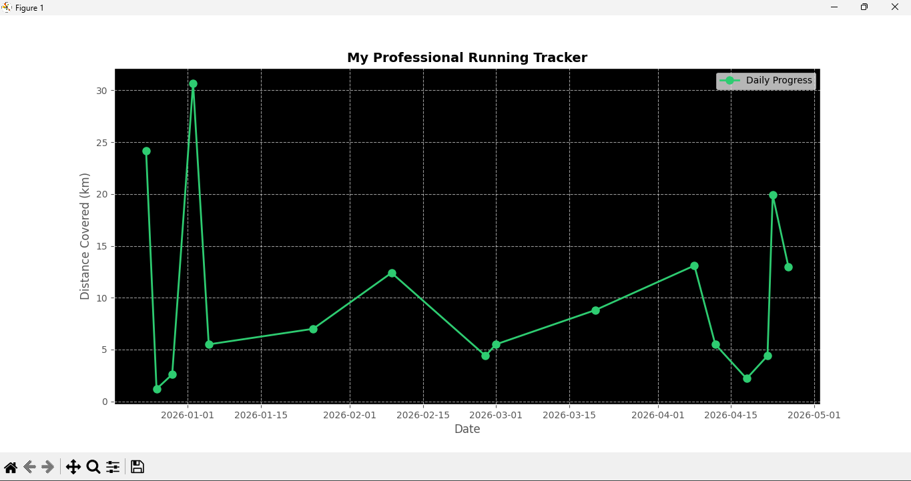

# running-tracker-pro
A Python-based CLI running tracker that logs daily runs and visualizes progress using matplotlib.


# 🏃 Running Tracker Pro

A simple and professional command-line running tracker built with Python.  
Track your daily runs and visualize your progress with graphs.

---

## 🚀 Features

- Log  your daily running distance
- Store data in CSV format
- Visualize progress using matplotlib
- Clean CLI interface

---

## 🛠️ Tech Stack

- Python
- Pandas
- Matplotlib

---

## 📊 Sample Output



---

## ▶️ How to Run

```bash
pip install -r requirements.txt
python running_tracker.py
